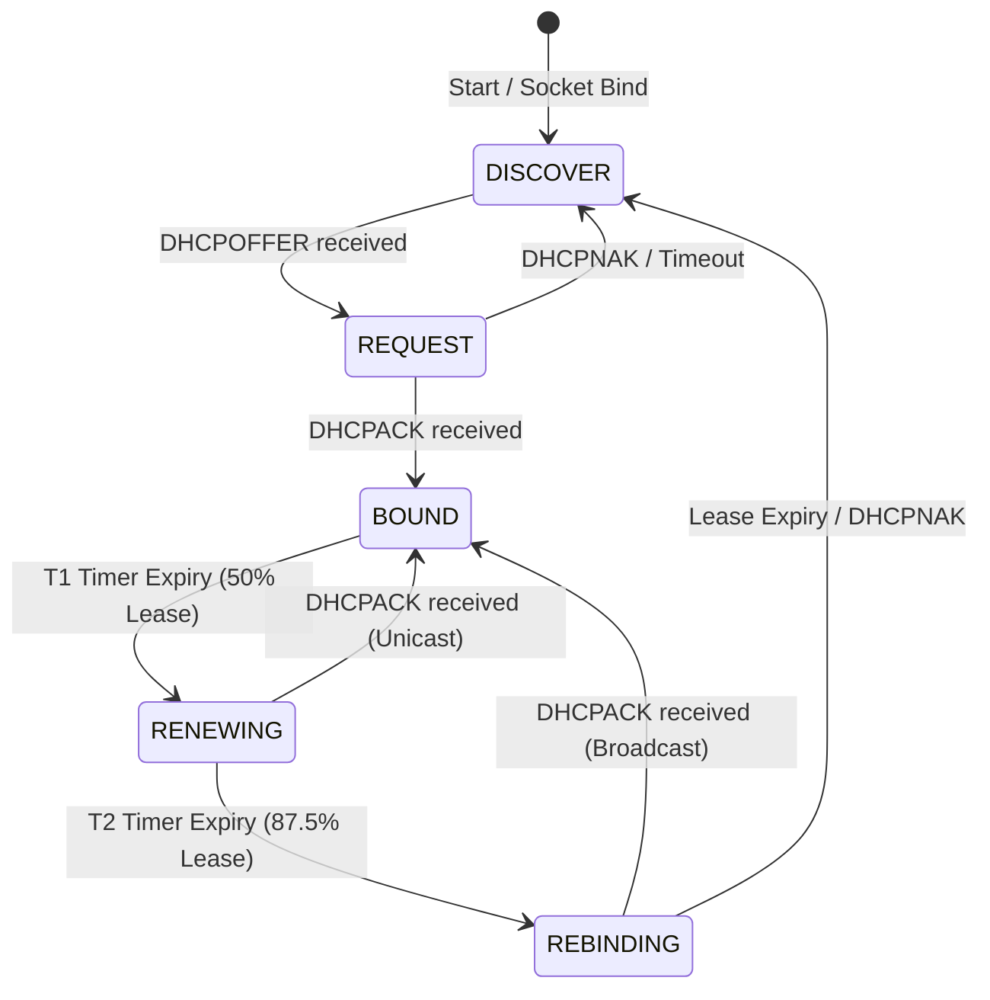

# Specification: WAN DHCP Client

The DHCP Client is an embedded service in `trimrouter` responsible for negotiating IPv4 network configuration dynamically with an upstream DHCP server on the WAN interface.

---

## 1. Socket and Packet Mechanics

Because the WAN interface does not have an IP address assigned during initial configuration, the DHCP client cannot use standard UDP socket abstractions (`std::net::UdpSocket`). Instead, it communicates directly with the network hardware link layer:

*   **Socket Type**: A raw packet socket (`AF_PACKET` / `SOCK_RAW`) bound directly to the WAN interface.
*   **Userspace Header Construction**: The client constructs complete ethernet frames including:
    *   **Ethernet Header**: Source MAC set to the WAN interface hardware address; destination MAC set to broadcast (`FF:FF:FF:FF:FF:FF`).
    *   **IPv4 Header**: Source IP set to `0.0.0.0` (or the currently leased IP during renewal); destination IP set to `255.255.255.255` (or the unicast server IP during renewal).
    *   **UDP Header**: Source port set to `68` (DHCP client); destination port set to `67` (DHCP server).
*   **Response Filtering**: Parses incoming raw packets, matching the client MAC address and transaction ID (`xid`) to filter out other traffic.

---

## 2. State & Phase Transitions

The DHCP client transitions through a standard RFC 2131 state machine:

### 2.1 DISCOVER Phase
*   Generates a random 32-bit transaction ID (`xid`).
*   Broadcasts a `DHCPDISCOVER` packet on the WAN interface.
*   Listens for a matching `DHCPOFFER` response.
*   If no offer is received within the timeout, retries with exponential backoff starting at 4 seconds up to a maximum of 64 seconds.

### 2.2 REQUEST Phase
*   Broadcasts a `DHCPREQUEST` packet containing:
    *   The requested IP address (from the selected `DHCPOFFER`).
    *   The Server Identifier (Option 54) pointing to the offering DHCP server.
*   Listens for a matching `DHCPACK` or `DHCPNAK`.
*   If `DHCPACK` is received, extracts network parameters and transitions to **BOUND**.
*   If `DHCPNAK` is received or the phase times out, restarts to **DISCOVER**.

### 2.3 BOUND Phase
*   Applies the configuration parameters to the WAN interface using `NETLINK_ROUTE`:
    *   Assigns the leased IP address and subnet mask.
    *   Sets up the default gateway route.
*   Writes the lease details (IP, gateway, DNS servers) to the thread-safe `WanLease` shared state.
*   Triggers the lease renewal timer based on the lease duration:
    *   **T1 (Renewal)**: `lease_secs / 2`
    *   **T2 (Rebinding)**: `lease_secs * 0.875`
*   If the lease expires without renewal, calls `deconfigure()` to clear the IP and routes, resets the shared `WanLease`, and returns to **DISCOVER**.

### 2.4 RENEWING State
*   Upon T1 expiry, sends a unicast `DHCPREQUEST` directly to the DHCP server's IP address.
*   If a `DHCPACK` is received, updates the lease timers, reapplies config if changed, and returns to **BOUND**.
*   If no response is received, continues unicast retries until T2 is reached.

### 2.5 REBINDING State
*   Upon T2 expiry, broadcasts a `DHCPREQUEST` to `255.255.255.255`.
*   If a `DHCPACK` is received, updates lease timers, reapplies config, and returns to **BOUND**.
*   If the lease fully expires without an ACK, or if a `DHCPNAK` is received, immediately tears down the interface IP and routes via `deconfigure()` and restarts at **DISCOVER**.

---

## 3. Configuration Parameters & Options

The client requests and parses the following standard DHCP options:
*   **Subnet Mask** (Option 1): Used to compute the local subnet boundary.
*   **Router / Default Gateway** (Option 3): The gateway IP to route all external traffic.
*   **DNS Servers** (Option 6): List of upstream DNS resolver IPs.
*   **IP Address Lease Time** (Option 51): Duration of the lease in seconds.
*   **DHCP Message Type** (Option 53): Identifies the packet type (Discover, Offer, Request, Ack, Nak).
*   **Server Identifier** (Option 54): Server IP address to target for renewals and requests.

---

## 4. Failure Recovery & Robustness

*   **Socket Reinitialization**: If the raw socket encounters persistent read/write errors, the client tears down the socket, waits 5 seconds (`SOCKET_RESTART_DELAY_SECS`), and binds a new socket.
*   **Unrecoverable Lease Expiry**: To prevent routing blackholes, if the lease expires during rebinding, the client immediately deletes the IP address and the default gateway route from the WAN interface before restarting discovery.
*   **LAN/WAN Subnet Overlap Handling**: Subnet conflicts and overlaps between WAN and LAN subnets are managed reactively by the dedicated LAN Manager service.

