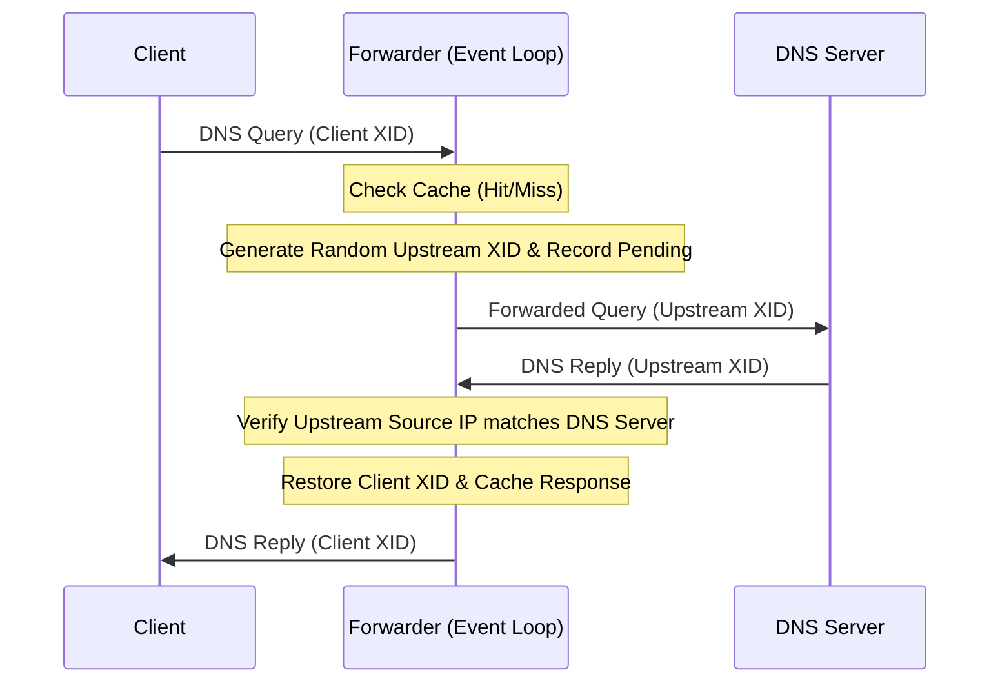

# Specification: DNS Forwarder

The DNS Forwarder is a local DNS proxy service in `trimrouter` that resolves DNS queries for LAN clients by forwarding them to upstream DNS resolvers, caching responses, and defending against cache poisoning and port exhaustion.

> [!NOTE]
> **Status: Implemented.**

---

## 1. Network & Socket Architecture

*   **Service Binding**: Binds to port `53` (UDP) on the LAN interface to accept client queries.
*   **Upstream Client Socket**: Binds a single, long-lived client UDP socket (`0.0.0.0:0`) for all outgoing upstream DNS queries.
    > [!TIP]
    > Reusing a single socket avoids binding and closing temporary sockets for each query, preventing ephemeral port exhaustion in high-concurrency environments.

---

## 2. Upstream Forwarding & Security Mechanics

To support concurrent requests over a single socket safely, `trimrouter` implements a transaction mapping and verification pipeline:

### 2.1 Transaction ID (XID) Randomization
For every query forwarded upstream:
1.  The client's original transaction ID (XID) and destination address are saved.
2.  A new, cryptographically random transaction ID is generated.
3.  A pending record is registered in the `pending_queries` map, mapping the new transaction ID to the client state and deadline.

### 2.2 Cache Poisoning & Spoofing Protection
*   The unified event loop selects over client and upstream sockets.
*   Upon receiving an upstream response, it extracts the transaction ID and retrieves the pending record.
*   **Verification**: Validates that the packet's sender IP and port match the expected upstream DNS server socket (`IP:53`).
*   **Discarding**: If the sender address does not match or the transaction ID is unrequested, the packet is logged as a DNS spoofing attempt and discarded, protecting the local resolver cache from poisoning.
*   If valid, the response is cached, the original transaction ID is restored, and the reply is returned to the client.

### 2.3 Upstream Target Selection & Fallback
*   Retrieves the list of upstream DNS servers from the WAN interface's active `WanLease` configuration.
*   **Resolver Sanitization**: Filters out loopback (`127.0.0.0/8`), unspecified (`0.0.0.0`), and broadcast (`255.255.255.255`) addresses to prevent amplification loops (CVE-2014-0472).
*   Attempts resolution sequentially across the configured valid upstream resolvers. If an upstream resolver times out or fails to respond, it automatically attempts the next resolver in the list.
*   If the WAN lease has no valid DNS servers or is inactive, falls back to `8.8.8.8` (Google DNS).

---

## 3. Cache Design

The forwarder maintains an in-memory cache to reduce external latency and DNS traffic:

*   **Cache Key**: Structured as `domain_name:query_type:query_class` (e.g., `google.com:A:IN`). Queries with non-standard opcodes or zero questions are rejected.
*   **Bounded Capacity**: The cache is bounded to a maximum of 4096 entries (`MAX_CACHE_ENTRIES`). When full, the entry with the earliest expiry is evicted upon inserting a new entry.
*   **TTL Calculation & Semantics**:
    *   Parses response packets using the `hickory-proto` crate.
    *   **Positive Answers (RFC 2181)**: Finds the minimum TTL among all resource records in the answer section. If `TTL == 0`, the response is returned to the client and never cached. Non-zero TTLs are capped at a maximum of 3600 seconds (`MAX_TTL_SECS` / 1 hour).
    *   **Negative Caching (RFC 2308)**:
        *   `NXDOMAIN` (Name Error) and `NODATA` (`NoError` with 0 answers) responses are cached to reduce redundant WAN traffic.
        *   Extracts the SOA record from the Authority section and sets the negative TTL to $\min(\text{SOA.ttl}, \text{SOA.minimum})$, clamped between 5 seconds (`MIN_NEGATIVE_TTL_SECS`) and 300 seconds (`MAX_NEGATIVE_TTL_SECS`).
        *   If no SOA record is present, defaults to 60 seconds (`DEFAULT_NEGATIVE_TTL_SECS`).
        *   Server error responses (`SERVFAIL`, `REFUSED`, `FORMERR`, etc.) are never cached.
*   **Cache Cleanup**: The unified event loop periodically ticks on `CLEANUP_INTERVAL` to prune expired cache entries and check pending query timeouts. Expired entries are also purged upon lookup.

---

## 4. Local Split-Horizon LAN Hostname Resolution

To allow LAN devices to discover and address each other using human-readable names without external DNS dependency, the DNS Forwarder implements local split-horizon resolution:

### 4.1 Local Domain & Host Registration
*   **Designated Local Domain**: `.lan` (e.g., `printer.lan`, `router.lan`).
*   **Dynamic IPC Registration**: Receives dynamic host registrations (`AddLocalHost { name, ip }` and `RemoveLocalHost { name }`) from the parent supervisor as LAN DHCP leases are allocated or released.
*   **Router Gateway Hostname**: Automatically registers the router's own LAN gateway IP under `router` and `router.lan`.

### 4.2 Query Interception & Authoritative Response
Before forwarding a query upstream or checking the cache, the forwarder inspects the question `QNAME` and `QTYPE`:
1.  **Forward Lookups (`A` & Other Types)**:
    *   **Single-Label & Local Domain `A` Queries**: If the query is for `<name>` or `<name>.lan`, and `<name>` matches a registered local host, the forwarder synthesizes an authoritative `A` record response returning the registered LAN IP.
    *   **Dual-Stack Non-`A` Queries (`AAAA`, `HTTPS`, etc.)**: If a query is for a registered local host but requests a non-`A` record type (such as `AAAA`), the forwarder returns an authoritative `NoError` response with an empty answer section (`NODATA` per RFC 4074 / RFC 2308), allowing dual-stack clients to immediately proceed to IPv4 without leaking queries upstream.
    *   **Non-Existent `.lan` Names**: If a query ends with `.lan` but does not match any registered local host, the forwarder immediately returns an authoritative `NXDOMAIN` for all query types without forwarding the request upstream to public DNS resolvers.
2.  **Reverse Lookups (`PTR` Records)**:
    *   If a reverse DNS query (`*.in-addr.arpa`) corresponds to an active local host IP in the LAN subnet (or the gateway IP), the forwarder returns an authoritative `PTR` record mapping the IP back to `<hostname>.lan`.
3.  **Authoritative Answer Flags & TTL**:
    *   Local responses are returned with the `AA` (Authoritative Answer) bit set.
    *   Local records are served with a fixed short TTL of 60 seconds (`LOCAL_DNS_TTL_SECS`).
4.  **Security & Public TLD Isolation**:
    *   Queries for public domains (e.g., `example.com`, `google.com`, `apple.com`) are **never** intercepted by local DHCP hostnames and are strictly resolved via upstream DNS servers.
5.  **Multicast DNS (`.local`) Query Isolation (RFC 6762)**:
    *   Queries for `*.local` received on standard unicast DNS port 53 are **never forwarded upstream to WAN resolvers** (preventing internal LAN query leaks and redundant WAN traffic).
    *   The forwarder immediately returns an authoritative `NXDOMAIN` on port 53, allowing mDNS-capable clients to resolve peer-to-peer over UDP port 5353.

---

## 5. Limitations

*   **UDP Only**: The DNS forwarder supports only UDP DNS queries. TCP DNS queries (such as large zones or DNSSEC fallbacks) are not supported.
*   **Upstream Timeout**: Upstream queries time out after 3 seconds (`UPSTREAM_TIMEOUT`), at which point the pending query entry is evicted to prevent memory growth.
