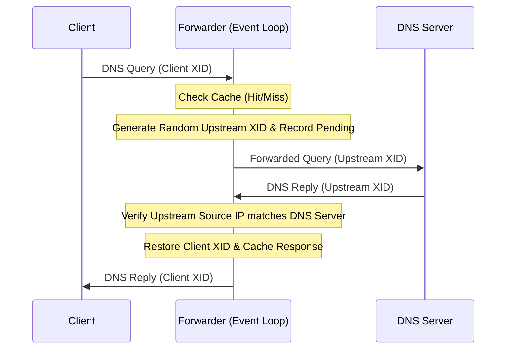

# Specification: DNS Forwarder

The DNS Forwarder is a local DNS proxy service in `trimrouter` that resolves DNS queries for LAN clients by forwarding them to upstream DNS resolvers, caching responses, and defending against cache poisoning and port exhaustion.

> [!NOTE]
> **Status: Implemented.**

---

## 1. Network & Socket Architecture

*   **Service Binding**: Binds to port `53` (UDP) on the LAN interface to accept client queries.
*   **Upstream Client Socket**: Binds a single, long-lived client UDP socket (`0.0.0.0:0`) for all outgoing upstream DNS queries.
    > [!TIP]
    > Reusing a single socket avoids binding and closing temporary sockets for each query, preventing ephemeral port exhaustion in high-concurrency environments.

---

## 2. Upstream Forwarding & Security Mechanics

To support concurrent requests over a single socket safely, `trimrouter` implements a transaction mapping and verification pipeline:

### 2.1 Transaction ID (XID) Randomization
For every query forwarded upstream:
1.  The client's original transaction ID (XID) and destination address are saved.
2.  A new, cryptographically random transaction ID is generated.
3.  A pending record is registered in the `pending_queries` map, mapping the new transaction ID to the client state and deadline.

### 2.2 Cache Poisoning & Spoofing Protection
*   The unified event loop selects over client and upstream sockets.
*   Upon receiving an upstream response, it extracts the transaction ID and retrieves the pending record.
*   **Verification**: Validates that the packet's sender IP address matches the expected upstream DNS server IP.
*   **Discarding**: If the sender IP does not match, the packet is logged as a DNS spoofing attempt and discarded, protecting the local resolver cache from poisoning.
*   If valid, the response is cached, the original transaction ID is restored, and the reply is returned to the client.

### 2.3 Upstream Target Selection & Fallback
*   Retrieves the list of upstream DNS servers from the WAN interface's active `WanLease` configuration.
*   Attempts resolution sequentially across the configured upstream resolvers. If an upstream resolver times out or fails to respond, it automatically attempts the next resolver in the list.
*   If the WAN lease has no DNS servers or is inactive, falls back to `8.8.8.8` (Google DNS).

---

## 3. Cache Design

The forwarder maintains an in-memory cache to reduce external latency and DNS traffic:

*   **Cache Key**: Structured as `domain_name:query_type:query_class` (e.g., `google.com:A:IN`).
*   **Bounded Capacity**: The cache is bounded to a maximum of 4096 entries (`MAX_CACHE_ENTRIES`). When full, the entry with the earliest expiry is evicted upon inserting a new entry.
*   **TTL Calculation**:
    *   Parses response packets using the `dns-parser` crate.
    *   Finds the minimum TTL among all resource records in the answer section.
    *   Caps the cache entry duration to a maximum of 3600 seconds (`MAX_TTL_SECS`) and a minimum fallback of 30 seconds (`DEFAULT_TTL_SECS`).
*   **Cache Cleanup**: The unified event loop periodically ticks on `CLEANUP_INTERVAL` to prune expired cache entries and check pending query timeouts.

---

## 4. Limitations

*   **UDP Only**: The DNS forwarder supports only UDP DNS queries. TCP DNS queries (such as large zones or DNSSEC fallbacks) are not supported.
*   **Upstream Timeout**: Upstream queries time out after 3 seconds (`UPSTREAM_TIMEOUT`), at which point the pending query entry is evicted to prevent memory growth.
