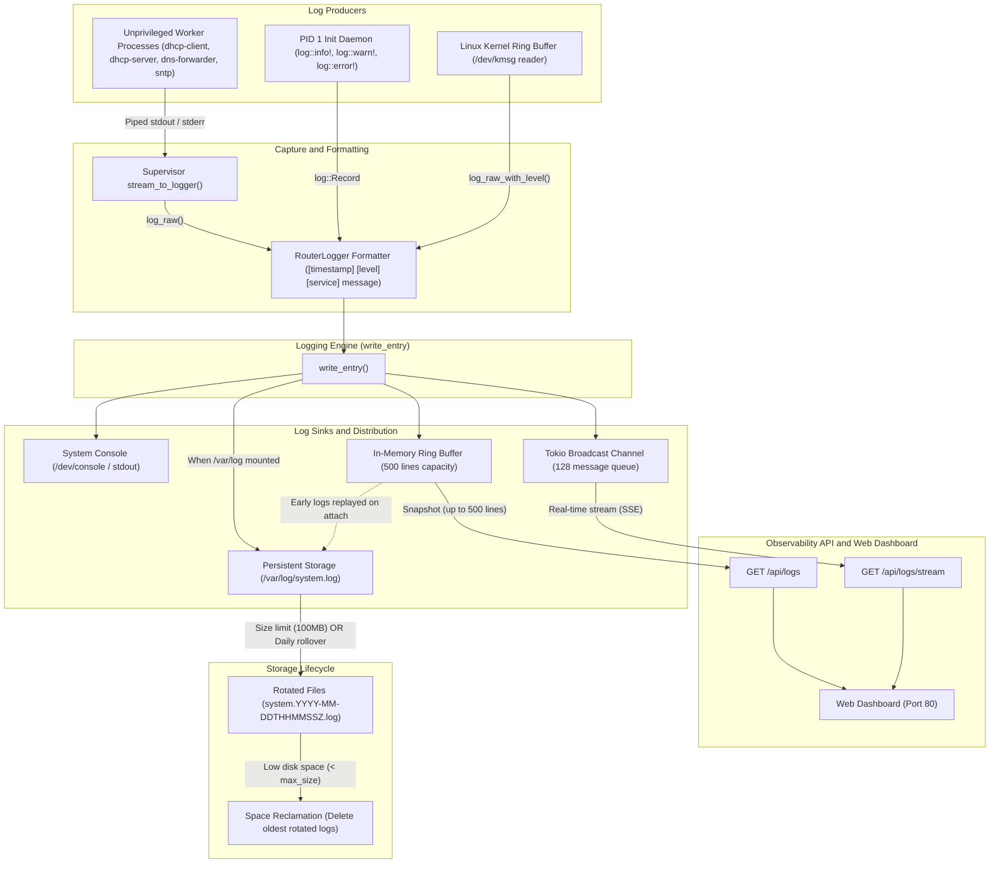

# Specification: Logging

This specification describes how `trimrouter` captures, formats, persists, and rotates log output from PID 1 and all worker services.

---

## 1. Logging Pipeline Architecture



---

## 2. Log File

All log output is written to a **single unified log file** on the log partition:

| File | Description |
| :--- | :--- |
| `/var/log/system.log` | Active log — all services and PID 1 init output, in chronological order |

The file is opened in **append mode** so that output accumulates across worker restarts within the same boot session.

---

## 3. Log Line Format

Each line written to `system.log` is stamped, prioritized by log level, and tagged with the service name:

```
[<UTC timestamp>] [<LEVEL>] [<service>] <message>
```

Example:

```
[2026-08-14T14:30:00Z] [INFO] [init] Mounted /boot successfully.
[2026-08-14T14:30:01Z] [WARN] [dhcp-client] Sending DHCPDISCOVER on wan...
[2026-08-14T14:30:01Z] [INFO] [dns-forwarder] Listening on 192.168.1.1:53
[2026-08-14T14:30:02Z] [INFO] [dhcp-client] DHCPOFFER received from 10.0.2.2
[2026-08-14T14:30:03Z] [DEBUG] [dns-forwarder] Cache query hit for router.lan
[2026-08-14T14:30:04Z] [ERROR] [lan-manager] Failed to bind raw socket: permission denied
```

Timestamps are UTC in ISO 8601 format. The `[<LEVEL>]` tag corresponds to standard Rust `log` crate levels: `ERROR`, `WARN`, `INFO`, `DEBUG`, `TRACE`. The `[<service>]` tag corresponds to the module or service target (e.g., `init`, `dhcp-client`, `dhcp-server`, `dns-forwarder`, `sntp`).

Individual service output or severity levels can be filtered from the unified log with any text tool, e.g.:

```bash
grep '\[dhcp-client\]' system.log
grep '\[ERROR\]' system.log
```

---

## 4. Log Rotation

PID 1 manages log rotation entirely in-process. No external tools or cron daemon are required.

### 4.1 Rotation Triggers

`system.log` is rotated when **either** of the following conditions is met:

| Trigger | Condition | Default |
| :--- | :--- | :--- |
| **Size limit** | The active log file reaches or exceeds the configured maximum size | `100 MiB` (configurable) |
| **Daily rollover** | Midnight UTC is crossed while the system is running | Fixed — once per calendar day |

PID 1 evaluates the size trigger on every write. The daily trigger is evaluated by comparing the current UTC date against the date recorded at the last rotation (or boot). Both triggers are checked independently; whichever fires first causes the rotation.

### 4.2 Rotation Procedure

1. **Check free space**: Query the log partition's available bytes (`statvfs`). If available space is less than `max_log_size`, run the **space reclamation** step (§4.3) before proceeding.
2. **Rename active log**: Rename `system.log` → `system.<timestamp>.log`, where `<timestamp>` is the ISO 8601 UTC datetime at the moment of rotation (e.g. `system.2026-08-14T143000Z.log`). A timestamp suffix is used instead of a counter to allow multiple size-triggered rotations within the same calendar day.
3. **Open new active log**: Create a fresh `system.log` in append mode and continue writing.

### 4.3 Space Reclamation

Before creating a new rotated log file, if available space on the log partition is below `max_log_size`, PID 1 deletes rotated `system.<timestamp>.log` files in order from **oldest to newest** until sufficient space is freed or no more rotated files remain.

The age of a rotated log file is determined by the UTC timestamp embedded in its filename. The active `system.log` file is **never** deleted by the reclamation process.

If reclamation cannot free enough space (all rotated files have already been deleted), PID 1 logs a warning to the console and **stops writing** to the log partition until the next boot.

> [!NOTE]
> FAT32 supports file modification and creation timestamps with 2-second resolution. PID 1 must use the filename timestamp (not FAT32 metadata) as the authoritative sort key for reclamation order, since FAT32 timestamps can be unreliable across timezones and host operating systems.

---

## 5. Configuration

Logging configuration is specified in `trimrouter.toml` under the `[logging]` section:

```toml
[logging]
max_log_size_mb = 100   # (Optional: defaults to 100 MiB)
level = "info"          # (Optional: "error", "warn", "info", "debug", "trace" — defaults to "info")
```

If the `[logging]` section or any key is absent, defaults are used (`max_log_size_mb = 100`, `level = "info"`). Messages below the configured log level are filtered out before writing to disk.

---

## 6. Early Boot Logging & Console Fallback

PID 1 initializes early logging (`init_early_logging`) at the start of early boot:
1. **Early Boot**: Prior to mounting storage, log messages stream directly to the system console (`/dev/console`) and accumulate in the in-memory ring buffer.
2. **Log File Attachment**: As soon as the log partition is formatted/mounted to `/var/log`, `open_log_file` opens `/var/log/system.log` in append mode and flushes all buffered early boot log lines into the persistent file. All subsequent init events, configuration parsing warnings, and fatal errors stream concurrently to both `/dev/console` and `/var/log/system.log`.
3. **Panic Logging**: The custom panic hook formats the critical panic trace, writes it via the logging subsystem, and explicitly calls `flush` to sync the error to `/var/log/system.log` prior to system halt or reboot.
4. **Console Fallback**: If the log partition fails to mount, logging continues seamlessly in console-only mode without crashing PID 1. Log rotation and reclamation are disabled in console-only mode.

---

## 7. Write Buffering & SD Card Wear

PID 1 does **not** implement application-level write buffering and does **not** call `fsync` on every log line. All write coalescing is delegated to the **Linux kernel page cache**, which batches multiple writes to the same page into a single flash write before flushing — more efficiently than any userspace buffer can achieve.

Because trimrouter is PID 1 and mounts `/proc` at startup, it configures the kernel writeback parameters directly via `/proc/sys/vm/` before opening the log file:

| Parameter | Path | Value |
| :--- | :--- | :--- |
| Dirty page expiry | `/proc/sys/vm/dirty_expire_centisecs` | `3000` (30 s) |
| Writeback interval | `/proc/sys/vm/dirty_writeback_centisecs` | `500` (5 s) |

These are set explicitly rather than relying on kernel defaults, since compile-time defaults vary across kernel configurations and distributions. Setting them at startup guarantees consistent flush behaviour regardless of the underlying kernel build.

These values ensure dirty log pages are flushed to flash within at most 35 seconds (30 s expiry + up to 5 s writeback check interval), regardless of log write frequency.

`fsync` is called only on two occasions:
1. **Before rotation** — to ensure the completed log file is fully persisted before it is renamed.
2. **On clean shutdown** — to flush in-flight log buffers and execute a global filesystem `sync()` before executing system poweroff.

> [!NOTE]
> On an unclean power-off, up to 35 seconds of log output may be lost. This is an accepted trade-off for a router where SD card longevity outweighs log completeness.

