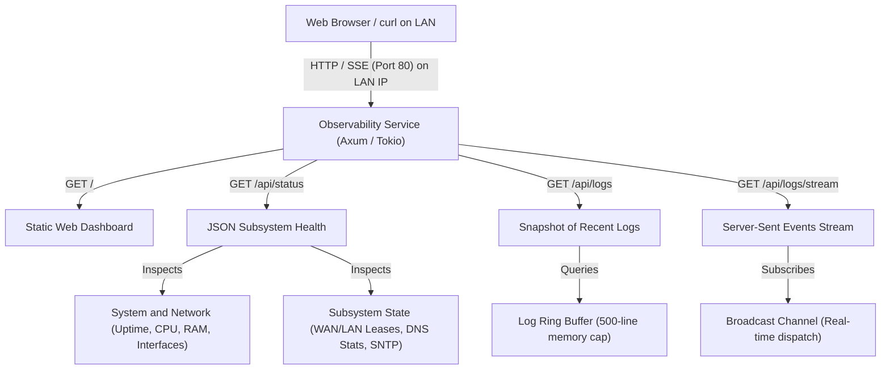

# Specification: Observability & Web Dashboard

This specification describes the built-in observability subsystem of `trimrouter`. It is an **always-on, zero-configuration core service** that provides a read-only HTTP status dashboard, JSON inspection API, and real-time log streaming mechanism on standard HTTP port `80` on the LAN interface.

---

## 1. Design Goals & Principles

1. **Always-On & Zero-Configuration**: Like DNS, DHCP, and NAT, the observability service is an integrated core capability of `trimrouter`. It requires zero configuration in `trimrouter.toml` and starts automatically on the LAN interface.
2. **Zero Client Setup**: Requires no monitoring agents, collectors (such as Prometheus, StatsD, or Telegraf), or dedicated server machines on the local network. Any device connected to the LAN can inspect the router using a standard web browser or `curl`.
3. **Strictly Read-Only (`GET` Only)**: In accordance with [`non_goals.md`](non_goals.md), `trimrouter` does not support runtime configuration mutation. The observability endpoint accepts only HTTP `GET` requests and cannot modify system state, firewall rules, or credentials.
4. **LAN-Only Isolation**: The HTTP server binds exclusively to standard port `80` on the router's LAN IP address and is blocked on the WAN interface by the Netfilter firewall.
5. **Privacy-Preserving**: Only aggregate counters and service lifecycle state are exposed. Per-client DNS browsing histories or packet payloads are never stored or exposed.
6. **Bounded Resource Footprint**: All live log streams and recent history use a fixed 500-line in-memory ring buffer (~64 KiB) with strict connection limits to prevent Out-Of-Memory (OOM) conditions or CPU exhaustion.

---

## 2. Architecture & Service Topology



---

## 3. HTTP Endpoints & API

All endpoints are served over standard HTTP on port `80` of the LAN gateway IP address (`http://router.lan` or `http://192.168.1.1`).

### 3.1 Endpoint Summary

| Path | Method | Content-Type | Description |
| :--- | :--- | :--- | :--- |
| `/` | `GET` | `text/html` | Embedded, single-file HTML/CSS/JS status dashboard |
| `/api/status` | `GET` | `application/json` | Snapshot of system health, network interfaces, and services |
| `/api/logs` | `GET` | `application/json` | Returns the recent lines from the in-memory log ring buffer |
| `/api/logs/stream` | `GET` | `text/event-stream` | Live real-time log stream via Server-Sent Events (SSE) |

---

## 4. Endpoint Specifications

### 4.1 Web Dashboard (`GET /`)

* **Purpose**: Provides a responsive, self-contained web user interface for human operators.
* **Implementation**: Embedded directly into the binary at compile time as a single HTML/CSS/JS asset (no external CDN dependencies or assets required).
* **Features**:
  * Visual status indicators for WAN link, LAN subnet, DNS forwarder, and SNTP synchronization.
  * Real-time active DHCP client table with hostnames, IP addresses, and lease expiry timers.
  * Live kernel ARP cache / neighbor table across WAN and LAN interfaces.
  * Live responsive bandwidth sparkline charts and rate monitors (RX/TX) for both WAN and LAN interfaces.
  * Hardware MAC address displays for both WAN and LAN interfaces.
  * Transparent memory utilization metrics (Total RAM, Used RAM, Free / Available RAM) and SD card log partition space.
  * Live log terminal panel backed by `/api/logs/stream` with pause, auto-scroll, and level filtering (`INFO`, `WARN`, `ERROR`).
  * Auto-refreshing system resource cards (uptime, CPU load, memory, storage, traffic).

---

### 4.2 Status JSON API (`GET /api/status`)

* **Purpose**: Provides a structured JSON payload representing the complete operational state of the router for scripts, CLI tools (`curl`), or custom integrations.
* **Payload Schema**: The schema is defined by the `StatusResponse` structure in [`src/services/observability/status.rs`](../src/services/observability/status.rs) and encompasses:
  * **`system`** (`SystemStatus`): Application version, Git commit SHA, system uptime, memory metrics (total/used/free), log storage space, CPU load averages (1m, 5m, 15m), and hardware watchdog active status.
  * **`network`** (`NetworkStatus`): Interface configuration, hardware MACs, IP addresses, netmasks, gateways, DNS servers, traffic counters (RX/TX bytes and packets), subnet mode for `lan` (`primary` vs. `backup`), and live kernel `arp_cache` entries across WAN and LAN interfaces.
  * **`dhcp_server`** (`DhcpServerStatus`): Total active leases count and active lease entries (`DhcpLeaseEntry`) including assigned IP, MAC, client hostname, remaining lease time, and static reservation indicator (`is_static`).
  * **`dns_forwarder`** (`DnsForwarderStatus`): Query counters, cache hit totals, cache hit ratio, in-memory cached entries count, and rate-limit drop metrics.
  * **`sntp`** (`SntpStatus`): Network time synchronization status, stratum, selected upstream NTP server, and timestamp of last synchronization.

---

### 4.3 Recent Logs (`GET /api/logs`)

* **Purpose**: Fetches the recent log history from the in-memory ring buffer.
* **Query Parameters**:
  * `lines` *(optional, integer, default: `100`, max: `500`)*: Number of recent log lines to retrieve.
  * `level` *(optional, string: `"error"`, `"warn"`, `"info"`, `"debug"`)*: Minimum severity filter.
* **Response Format**: Defined by the `LogsResponse` struct in [`src/services/observability/status.rs`](../src/services/observability/status.rs) containing:
  * **`total_lines_available`**: Total count of log lines currently retained in the in-memory ring buffer.
  * **`lines`**: Array of formatted log string entries matching query constraints.

---

### 4.4 Live Log Stream via Server-Sent Events (`GET /api/logs/stream`)

* **Purpose**: Delivers a continuous real-time stream of newly generated log entries to connected clients.
* **Protocol**: Server-Sent Events (SSE) over standard HTTP (`Content-Type: text/event-stream`).
* **Format**:
  ```http
  HTTP/1.1 200 OK
  Content-Type: text/event-stream
  Cache-Control: no-cache
  Connection: keep-alive

  data: [2026-09-27T18:31:05Z] [INFO] [dns-forwarder] Cache hit for router.lan
  
  data: [2026-09-27T18:31:12Z] [INFO] [dhcp-server] DHCPREQUEST received from 52:54:00:aa:bb:01

  ```
* **Client Compatibility**:
  * **Web Browsers**: Native standard JavaScript `EventSource("/api/logs/stream")`.
  * **CLI (`curl`)**: `curl -N http://router.lan/api/logs/stream` outputs streaming lines directly to stdout in real time like `tail -f`.

---

## 5. In-Memory Log Ring Buffer & Broadcaster

1. **Storage Layout**:
   * Fixed-capacity circular buffer storing up to **500 entries** (maximum memory bound: ~64 KiB).
   * Thread-safe access via asynchronous lock.
2. **Unified Dispatch**:
   * When any subsystem or worker emits a log event, PID 1's structured logger:
     1. Formats and writes the log line to persistent storage at `/var/log/system.log`.
     2. Appends the formatted log line into the in-memory ring buffer (evicting the oldest entry if at capacity).
     3. Sends the formatted log line to active SSE listeners using a non-blocking `tokio::sync::broadcast` channel (capacity: 128 queued items).
3. **Slow Client Protection (Backpressure)**:
   * If a connected streaming client lags behind and exhausts its broadcast channel queue, the server drops lagged frames for that client without stalling logger throughput or other clients.

---

## 6. Security, Privacy & Resource Safeguards

1. **Firewall Ingress Restriction & Interface Binding**:
   * Port `80` is open **only on the LAN interface**.
   * Incoming traffic on the WAN interface targeting port `80` is rejected by the Netfilter default-drop rule.
   * The HTTP server binds to the LAN interface using `SO_BINDTODEVICE` and the active LAN gateway IP address, supervised directly by the `LanManager` to migrate seamlessly across subnet shifts.
2. **Host Header Validation (DNS Rebinding Mitigation)**:
   * Every incoming HTTP request must include a valid `Host` header matching allowed router hostnames (`router.lan`, `router`, `router.local`), local loopback addresses (`localhost`, `127.0.0.1`, `::1`), or the current LAN gateway IP address.
   * Requests with unauthorized or foreign `Host` headers are rejected with `HTTP 400 Bad Request`.
3. **HTTP Security Headers**:
   * All HTTP responses include standard defensive headers:
     * `X-Frame-Options: DENY` (clickjacking defense).
     * `X-Content-Type-Options: nosniff` (MIME sniffing mitigation).
     * `Content-Security-Policy: default-src 'self'; script-src 'self' 'unsafe-inline'; style-src 'self' 'unsafe-inline'; connect-src 'self'; img-src 'self' data:; frame-ancestors 'none'; base-uri 'self';`
     * `Referrer-Policy: no-referrer`
4. **HTML Sanitization (XSS Prevention)**:
   * Dynamic fields rendered into the dashboard DOM (such as DHCP hostnames, IP addresses, MAC addresses, and log message payloads) are strictly HTML-escaped before insertion into innerHTML or table rows.
5. **Connection & Concurrency Limits**:
   * **Maximum Concurrent HTTP Connections**: 16.
   * **Maximum Global Concurrent Live Log Streams (SSE)**: 4.
   * **Maximum Concurrent Live Log Streams per Client IP**: 2.
   * Requests exceeding these concurrency thresholds receive `HTTP 429 Too Many Requests` or are closed cleanly to preserve memory.
6. **No Request Body Processing**:
   * The server rejects all methods other than `GET` with `HTTP 405 Method Not Allowed`.
   * The server ignores or rejects incoming request payloads exceeding 1 KiB to eliminate buffer bloat and payload injection risks.
7. **Privacy Isolation**:
   * The DNS forwarder exposes **aggregate statistics only** (total queries, hit/miss ratios, rate-limit drops).
   * Per-client domain names and visited websites are **never** tracked, buffered, or exposed.

---

## 7. Cross-Specification References

* [`router_spec.md`](router_spec.md) — PID 1 initialization, service controller lifecycle, and configuration schema.
* [`logging_spec.md`](logging_spec.md) — Persistent log format, rotation triggers, and space reclamation on `/var/log/system.log`.
* [`interface_spec.md`](interface_spec.md) — LAN/WAN lifecycle states and Netlink interface monitoring.
* [`non_goals.md`](non_goals.md) — Architectural invariants regarding immutable root filesystems and absence of runtime mutation.
